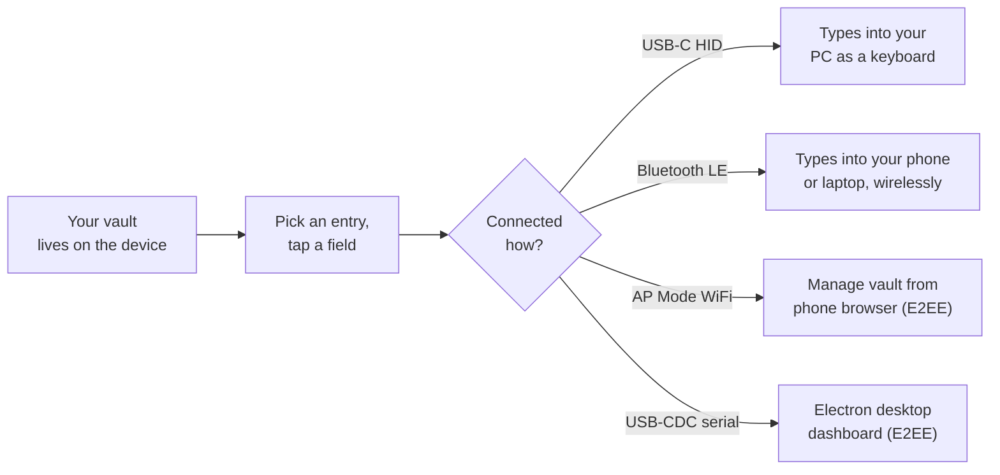
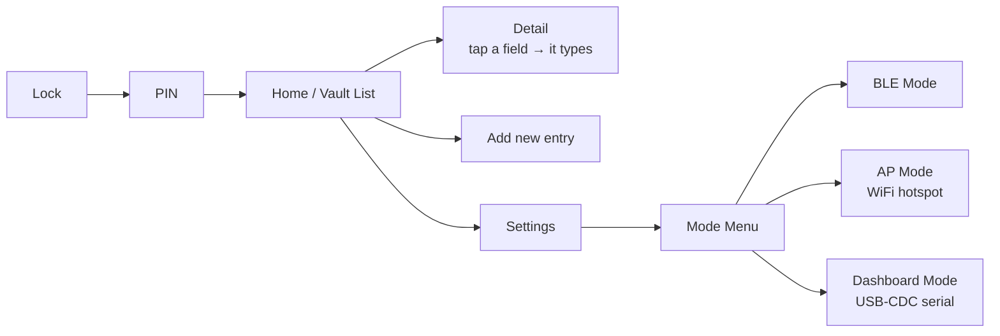
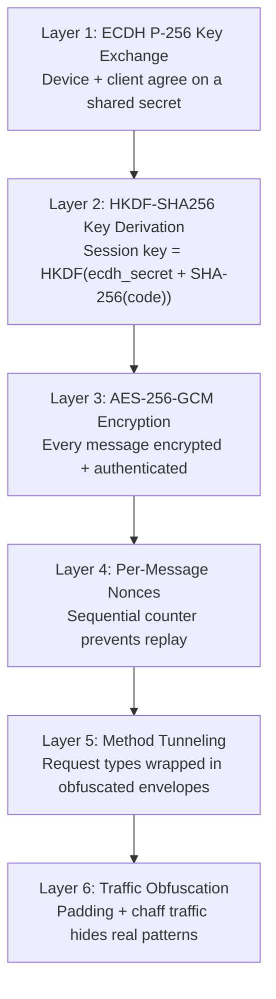

<div align="center">

# 🔐 SecureVault

### Offline hardware password manager with **6-layer encryption** — ESP32-S3 firmware + Electron desktop app + Chrome extension.

Your vault never leaves the device. No cloud. No accounts. No trust required.

[](https://www.espressif.com/en/products/socs/esp32-s3)
[](https://platformio.org/)
[](#)
[](#)
[](#)
[](#-6-layer-security-stack)
[](LICENSE)

</div>

> **SecureVault** is a hardware password manager built on the ESP32-S3 (EdgeHax S3-PRO, N16R8). It stores your passwords in an encrypted vault on the device itself, behind a PIN lock with brute-force backoff. You can type passwords into any device over **USB-C HID** or **Bluetooth LE HID** — no software, no drivers, no browser extensions required on the host. For bulk management, AP Mode spins up an end-to-end encrypted WiFi hotspot + webapp, and the Electron desktop companion connects over **USB-CDC serial with ECDH P-256 + AES-256-GCM**.

---

## 🔑 What it does, in one picture



To the host computer it just looks like someone typing — **no app, no browser extension, no account needed for basic use.**

---

## 🆚 How it compares

| | **SecureVault** | Cloud manager | Browser autofill |
|---|:---:|:---:|:---:|
| Where secrets live | 🔒 on the device | ☁️ company server | 💻 browser profile |
| Needs an account | ❌ | ✅ | ✅ |
| Needs host software for basic typing | ❌ | ✅ | ✅ |
| Works on any device, no install | ✅ (USB/BLE) | ❌ | ❌ |
| Usable fully offline | ✅ | ❌ | ❌ |
| End-to-end encrypted management | ✅ (ECDH+AES-GCM) | ❌ (server decrypts) | ❌ |
| Open hardware + firmware | ✅ | ❌ | ❌ |

---

## ✨ Features

| | Feature | What it does |
|---|---|---|
| ⌨️ | **Dual-transport typing** | Types passwords as real keystrokes over **USB-C HID** and **Bluetooth LE HID** simultaneously. |
| 🔐 | **6-Layer Security Stack** | ECDH P-256 handshake → HKDF-SHA256 key derivation → AES-256-GCM encryption → per-message nonce → method tunneling → traffic obfuscation. |
| 🔢 | **PIN lock + brute-force backoff** | 4-digit unlock with escalating lockout (30s → 60s → 2m → 5m) persisted across reboots. |
| 📶 | **AP Mode (WiFi hotspot)** | Spin up a captive-portal web app with end-to-end encryption. Join WiFi, enter a 6-digit code, manage vault from any phone browser. |
| 🖥️ | **Dashboard Mode (USB-CDC)** | Electron desktop companion connects over serial with full ECDH+AES-GCM session. Push/pull entries, view dashboard. |
| 🧩 | **Chrome Extension** | Browser extension syncs `.svlt` encrypted vault file with the Electron app for autofill, breach checking, and save prompts. |
| 🗂️ | **Encrypted vault on SD + Flash** | AES-256-GCM encrypted vault.db on SD card with atomic writes + backup rotation. LittleFS partition for session data. |
| 🔎 | **Search & favorites** | Live filtering with on-screen keyboard, plus favorites view. |
| 🛡️ | **Duress mode** | Separate decoy vault unlocked by a secondary PIN — real vault stays hidden. |
| 🔒 | **Auto-lock, sleep, factory reset** | Idle auto-lock, hold-to-lock, PIN-gated factory wipe. |
| 🎨 | **Custom TFT UI** | Hand-drawn UI on 320×240 ILI9341 TFT — color avatars, glow effects, pill toggles. |
| 📊 | **RTC + diagnostics** | DS3231 RTC for timestamps, MPU6050 IMU, AT24C32 EEPROM, full diagnostic logging. |
| 🔐 | **Secure key zeroing** | All ECDH private keys, session keys, and PIN buffers wiped with `secureZero()` on lock/timeout/mode-exit. |

---

## 🧭 Getting around



---

## 🛡️ 6-Layer Security Stack

Every management session (AP Mode, Dashboard Mode) is protected by six independent layers:



**Key lifecycle**: all private keys and session keys are zeroed with `secureZero()` (volatile memset, not optimized away) on lock, timeout, mode-exit, or power-off.

---

## 🧰 Hardware

| Part | Detail |
|------|--------|
| **Board** | EdgeHax ESP32-S3 S3-PRO (N16R8) |
| **MCU** | ESP32-S3, dual-core, **8 MB octal PSRAM**, **16 MB flash** |
| **Display** | ILI9341, **320 × 240**, SPI TFT + XPT2046 touch |
| **RTC** | DS3231 (I²C) — timestamps on vault entries |
| **IMU** | MPU6050 (I²C) — motion-based auto-lock detection |
| **EEPROM** | AT24C32 (I²C) — persistent lockout counters |
| **SD Card** | microSD on dedicated HSPI bus — encrypted vault storage |
| **LED** | RGB status LED |
| **USB** | USB-C, native ESP32-S3 (USB-OTG / TinyUSB) |

---

## 🚀 Quick start

### 1. Build the firmware (PlatformIO)

| Tool | Version | Where |
|------|---------|-------|
| PlatformIO | latest | [platformio.org](https://platformio.org/) |
| ESP32-S3 core | Espressif v5.x | Via PlatformIO |

```bash
# Install PlatformIO
pip install platformio

# From the firmware directory:
cd firmware
pio run -t upload

# Monitor serial output (115200 baud):
pio device monitor
```

**First-time flash** (if the partition table changed):
```bash
pio run -t erase && pio run -t upload
```

### 2. Build the Electron desktop app

```bash
cd electron
npm install
npm start
```

The Electron app connects over USB-CDC serial. Make sure Dashboard Mode is active on the ESP32 (TFT shows a 6-digit code), then enter the code in the app.

### 3. Load the Chrome extension

1. Open `chrome://extensions/`
2. Enable **Developer mode**
3. Click **Load unpacked** → select the `extension/` folder
4. The SecureVault icon appears in your toolbar

### 4. Flash via web installer (no IDE needed)

Visit the self-flasher page — connect your ESP32-S3 via USB, click the button, and the firmware installs directly from the browser using [ESP Web Tools](https://esphome.io/esp-web-tools/). See `flasher/` for the hosted page.

---

## 📁 Project structure

```
SecureVault/
├── firmware/                    ESP32-S3 firmware (PlatformIO + ESP-IDF)
│   ├── src/                     C++ source files
│   │   ├── main.cpp             Main: setup/loop, UI controller, HID dispatch
│   │   ├── ui_screens.cpp       All screen drawing + touch handlers (~150KB)
│   │   ├── vault_manager.cpp   Encrypted vault CRUD on SD + flash
│   │   ├── web_vault_server.cpp AP Mode HTTPS server + E2EE webapp
│   │   ├── ap_mode_manager.cpp  WiFi AP lifecycle (start/stop/teardown)
│   │   ├── secure_session.cpp   ECDH P-256 + HKDF + AES-256-GCM session
│   │   ├── serial_protocol.cpp  Dashboard Mode USB-CDC serial protocol
│   │   ├── ble_keyboard_manager.cpp  BLE HID keyboard + pairing gate
│   │   └── ...                  Crypto, display, RTC, diagnostics, etc.
│   ├── include/                 Headers
│   │   ├── ui_screens.h         UiController + Screen enum
│   │   ├── portal_html.h        Captive-portal SPA (embedded HTML)
│   │   ├── vault_types.h        VaultEntry, SessionData structs
│   │   └── ...                  All module headers
│   ├── components/              ESP-IDF components (esp_littlefs, esp_tinyusb, tinyusb)
│   ├── docs/                    AP_MODE.md, GPIO_MAP.md
│   ├── platformio.ini           Build configuration
│   ├── sdkconfig.defaults       ESP-IDF sdkconfig overrides
│   ├── partitions.csv           Flash partition table
│   └── CMakeLists.txt           ESP-IDF CMake
│
├── electron/                    Desktop companion app (Electron)
│   ├── main.js                  Main process: serial channel, vault ops, IPC
│   ├── preload.js               Context bridge to renderer
│   ├── secureChannel.js         ECDH + AES-256-GCM over USB-CDC serial
│   ├── vaultCrypto.js           Vault encryption/decryption (PBKDF2 + AES-GCM)
│   ├── vaultFileCrypto.js       .svlt v2 file format for extension sync
│   ├── breachCheck.js           HaveIBeenPwned API integration
│   ├── wordlist.js              Diceware wordlist for passphrase generation
│   ├── renderer/                UI (index.html + renderer.js + style.css)
│   └── package.json             Electron + serialport dependencies
│
├── extension/                   Chrome extension (Manifest V3)
│   ├── manifest.json            MV3 manifest with permissions
│   ├── background.js            Service worker: vault sync, autofill engine
│   ├── content.js               Content script: form detection
│   ├── window.js                Vault UI (popup window)
│   ├── window.html              Vault HTML
│   ├── window.css               Vault styles
│   ├── inline-overlay.js        In-page overlay for credential capture
│   ├── save-prompt.js           New-credential save prompt
│   ├── urlMatcher.js            URL matching for autofill
│   ├── vaultFileCrypto.js       .svlt file read/write (shared with Electron)
│   ├── breachCheck.js           Breach checking (shared with Electron)
│   ├── icons/                   Unlocked icons (16/48/128px)
│   └── icons_locked/            Locked icons (16/48/128px)
│
├── docs/                        Project documentation
│   ├── AP_MODE.md               AP Mode architecture, threat model, troubleshooting
│   ├── GPIO_MAP.md              ESP32-S3 GPIO pin assignments
│   └── ARCHITECTURE.md          Full architecture deep dive
│
├── scripts/                     Utility scripts
│   └── disable_component_manager.py  ESP-IDF component manager disable
│
├── flasher/                     Web-based firmware installer
│   ├── index.html               ESP Web Tools installer page
│   ├── manifest.json            Firmware manifest for ESP Web Tools
│   └── firmware/                Pre-built binary files for web flasher
│
├── .github/workflows/           CI
│   └── build.yml                PlatformIO build on push/PR
│
├── .gitignore                   Ignore patterns
├── LICENSE                      MIT license
├── CONTRIBUTING.md              Contribution guidelines
├── SETUP.md                     New-machine setup guide
└── README.md                    This file
```

---

## 🖥️ Using Dashboard Mode

1. Power on → enter PIN → vault list.
2. Tap the **mode badge** (top-right) → **DASHBOARD**.
3. TFT shows a **6-digit code** (e.g. `482917`).
4. Launch the Electron app → click **Connect to ESP32 Device**.
5. Enter the 6-digit code → ECDH handshake completes (~100ms).
6. All reads/writes are AES-256-GCM encrypted frames over USB-CDC serial.
7. Exit: tap mode badge → **BLE MODE**, or click **Lock** in the Electron app.

---

## 📶 Using AP Mode

1. Power on → enter PIN → vault list.
2. Tap mode badge → **AP MODE**.
3. TFT shows SSID, WPA2 password, and 6-digit code.
4. On your phone: join the WiFi → open `http://192.168.4.1/` (captive portal auto-opens).
5. Enter the 6-digit code → ECDH handshake → vault loads in the browser.
6. All traffic is end-to-end encrypted (same 6-layer stack).
7. Exit: tap **BACK**, or idle timeout (5 min), or auto-lock.

> Every AP session regenerates the WPA2 password + 6-digit code + ECDH keypair. Exiting AP mode tears down WiFi, DNS, mDNS, the web server, and zeros all session credentials with `secureZero()`.

---

## 🧩 Using the Chrome Extension

1. Load the extension (Developer mode → Load unpacked → `extension/` folder).
2. Set a master password — this encrypts the local `.svlt` vault file.
3. The Electron app and extension share the `.svlt` file for two-way sync:
   - **Extension → Electron**: new logins captured on the web get pushed to the ESP32.
   - **Electron → Extension**: entries synced from the ESP32 appear in the browser autofill.
4. Inline overlay detects login forms and offers to save credentials.
5. Breach check queries HaveIBeenPwned (k-anonymity API) for password exposure.

---

## 🔐 Security model

**What it does today:**
- Vault is **offline**, PIN-gated, and encrypted at rest (AES-256-GCM on SD card).
- Brute-force PIN backoff persists across reboots (stored in AT24C32 EEPROM).
- AP Mode and Dashboard Mode require **ECDH P-256 handshake** before any vault data flows.
- All session keys zeroed with `secureZero()` on lock/timeout/exit.
- Duress mode: secondary PIN unlocks a decoy vault, real vault stays hidden.
- Browser extension vault file uses PBKDF2-SHA512@600k iterations + AES-256-GCM + HMAC-SHA256.

**What it does not do yet** (PRs welcome):
- ESP32 **Flash Encryption** + **Secure Boot v2** (one-way fuses, release mode).
- **FIDO2 / WebAuthn** passkey (ECC P-256).
- **TOTP / 2FA** code generator (HMAC-SHA1) — code exists but is not yet wired into the UI.

Treat this as a **strong DIY / learning project with real crypto**, not a certified security product. See the roadmap.

---

## 🗺️ Architecture

### Firmware (ESP32-S3)

The firmware is a PlatformIO project using the `arduino` + `espidf` dual framework. The main loop runs at ~60Hz: poll touch, render screen, service background managers (BLE, WiFi AP, auto-lock, secure session). No RTOS scheduling in user code.

```
loop() @ ~60 Hz
 ├── pollTouch() → tap/drag/swipe/long-press → onTapScreen()
 ├── per-screen animation ticks
 ├── BLE keyboard manager (advertise, pairing gate)
 ├── WiFi captive-portal service (AP Mode)
 ├── USB-CDC serial secure session (Dashboard Mode)
 ├── auto-lock / LED / physical button
 └── secure key lifecycle (zero on exit)
```

### Electron app

The Electron desktop app connects to the ESP32 over **USB-CDC serial** (no HTTP, no network stack). The secure channel (`secureChannel.js`) performs ECDH P-256 handshake, then all communication is AES-256-GCM encrypted frames. The app also reads/writes an encrypted `.svlt` file that the browser extension consumes, enabling two-way vault sync.

### Chrome extension

Manifest V3 extension with a service worker background, content scripts for form detection, and a popup vault UI. Shares `vaultFileCrypto.js` and `breachCheck.js` with the Electron app for format compatibility.

For the full deep dive, see **[docs/ARCHITECTURE.md](docs/ARCHITECTURE.md)**.

---

## 🛣️ Roadmap

- [x] Touch UI, encrypted vault, USB + BLE HID, AP Mode, Dashboard Mode
- [x] 6-Layer Security Stack (ECDH + HKDF + AES-GCM + nonces + tunneling + obfuscation)
- [x] Chrome extension + Electron desktop companion + `.svlt` file sync
- [x] Duress mode (decoy vault)
- [ ] **ESP32 Flash Encryption + Secure Boot v2** (one-way fuses)
- [ ] **FIDO2 / WebAuthn** passkey (ECC P-256)
- [ ] **TOTP / 2FA** code generator (HMAC-SHA1)
- [ ] Custom PCB + 3D-printed enclosure

---

## 🤝 Contributing

Contributions, bug reports, and hardware ports are welcome — see **[CONTRIBUTING.md](CONTRIBUTING.md)**.

## 📜 License

[MIT](LICENSE) © Purujith Kadekar.

## 🙌 Credits

- [EdgeHax](https://edgehax.com/) — ESP32-S3 S3-PRO hardware platform
- [Espressif](https://www.espressif.com/) — ESP32-S3 MCU + ESP-IDF framework
- [PlatformIO](https://platformio.org/) — build system
- [NimBLE-Arduino](https://github.com/h2zero/NimBLE-Arduino) — lightweight BLE stack
- [mbedtls](https://github.com/Mbed-TLS/mbedtls) — ECDH + HKDF + AES-GCM crypto
- [Electron](https://www.electronjs.org/) — desktop app framework
- [HaveIBeenPwned](https://haveibeenpwned.com/) — breach check API

<div align="center">

**If this project helped you, drop a ⭐ — it genuinely helps.**

</div>
